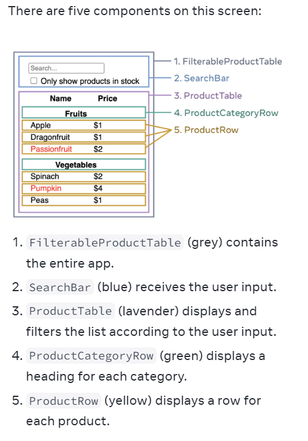

step1 : Summarize the five steps of thinking in react.
  1- Break the UI into a component hierarchy:
   Start by drawing boxes around every component and subcomponent in the mockup and naming them.

   

   Now that you’ve identified the components in the mockup, arrange them into a hierarchy. Components that appear within another component in the mockup should appear as a child in the hierarchy:

FilterableProductTable
 SearchBar
 - ProductTable
  - ProductCategoryRow
  - ProductRow
   

step2 : Build a static version in React.
   Now that you have your component hierarchy, it’s time to implement your app. The most straightforward approach is to build a version that renders the UI from your data model without adding any interactivity… yet! It’s often easier to build the static version first and add interactivity later. Building a static version requires a lot of typing and no thinking, but adding interactivity requires a lot of thinking and not a lot of typing.

   To build a static version of your app that renders your data model, you’ll want to build components that reuse other components and pass data using props. Props are a way of passing data from parent to child. (If you’re familiar with the concept of state, don’t use state at all to build this static version. State is reserved only for interactivity, that is, data that changes over time. Since this is a static version of the app, you don’t need it.)

step3 : Find the minimal but complete representation of UI state 
  Now think of all of the pieces of data in this example application:

   The original list of products
   The search text the user has entered
   The value of the checkbox
   The filtered list of products
  Which of these are state? Identify the ones that are not:

  - Does it remain unchanged over time? If so, it isn’t state.
  - Is it passed in from a parent via props? If so, it isn’t state.
  - Can you compute it based on existing state or props in your component? If so, it definitely isn’t state!

  - The original list of products is passed in as props, so it’s not state.
  - The search text seems to be state since it changes over time and can’t be computed from anything.
  - The value of the checkbox seems to be state since it changes over time and can’t be computed from anything.
  - The filtered list of products isn’t state because it can be computed by taking the original list of products and filtering it according to the search text and value of the checkbox.

This means only the search text and the value of the checkbox are state! Nicely done!

step4 : Identify where your state should live
   For each piece of state in your application:

 - Identify every component that renders something based on that state.
 - Find their closest common parent component—a component above them all in the hierarchy.
 - Decide where the state should live:
    - Often, you can put the state directly into their common parent.
    - You can also put the state into some component above their common parent.
    - If you can’t find a component where it makes sense to own the state, create a new component solely for holding the state and add it somewhere in the hierarchy above the common parent component.

step5 : Add inverse data flow.
 Currently your app renders correctly with props and state flowing down the hierarchy. But to change the state according to user input, you will need to support data flowing the other way: you can do this by defining callback functions in the parent component and passing them down to the child component as props.

What is one reason a local variable isn’t sufficient for managing a React component?

  - Local variables don’t persist between renders. When React renders this component a second time, it renders it from scratch—it doesn’t consider any changes to the local variables.
  - Changes to local variables won’t trigger renders. React doesn’t realize it needs to render the component again with the new data

  To update a component with new data, two things need to happen:

  - Retain the data between renders.
  - Trigger React to render the component with new data (re-rendering).

What is the argument to the useState hook, and what are the two parts of its return array?
   The useState Hook provides those two things:

    - A state variable to retain the data between renders.
    - A state setter function to update the variable and trigger React to render the component again.

How can Component A access state from Component B?
   The right way to do it in React is to remove state from child components and add it to their closest shared parent. 